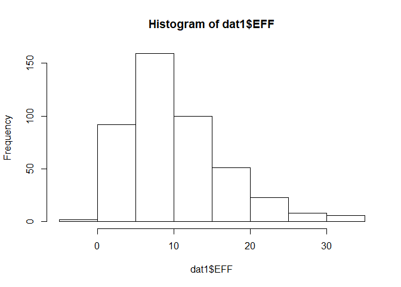
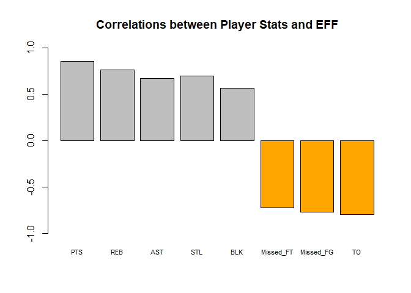
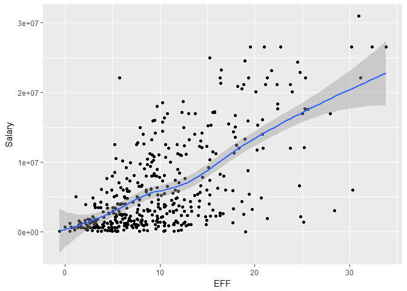
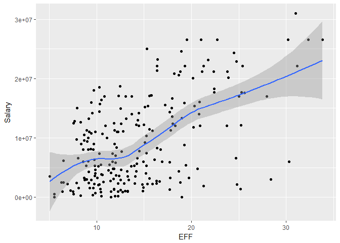

HW02 - Basics of Data Frames
================

``` r
library(readr)
library(dplyr)
```

    ## 
    ## Attaching package: 'dplyr'

    ## The following objects are masked from 'package:stats':
    ## 
    ##     filter, lag

    ## The following objects are masked from 'package:base':
    ## 
    ##     intersect, setdiff, setequal, union

``` r
library(ggplot2)
```

**2) Importing the data 2 ways**

Base

``` r
dat1 <- read.csv(file = "C:/Users/13noa/stat133/stat133-hws-fall17/hw02/data/nba2017-player-statistics.csv", colClasses = c("character", "character", NA, "character", "double", NA, NA, NA, NA, NA, NA, NA, NA, NA, NA, NA, NA, NA, NA, NA, NA, NA, NA, NA))

str(dat1)
```

    ## 'data.frame':    441 obs. of  24 variables:
    ##  $ Player      : chr  "Al Horford" "Amir Johnson" "Avery Bradley" "Demetrius Jackson" ...
    ##  $ Team        : chr  "BOS" "BOS" "BOS" "BOS" ...
    ##  $ Position    : Factor w/ 5 levels "C","PF","PG",..: 1 2 5 3 4 3 4 5 4 2 ...
    ##  $ Experience  : chr  "9" "11" "6" "R" ...
    ##  $ Salary      : num  26540100 12000000 8269663 1450000 1410598 ...
    ##  $ Rank        : int  4 6 5 15 11 1 3 13 8 10 ...
    ##  $ Age         : int  30 29 26 22 31 27 26 21 20 29 ...
    ##  $ GP          : int  68 80 55 5 47 76 72 29 78 78 ...
    ##  $ GS          : int  68 77 55 0 0 76 72 0 20 6 ...
    ##  $ MIN         : int  2193 1608 1835 17 538 2569 2335 220 1341 1232 ...
    ##  $ FGM         : int  379 213 359 3 95 682 333 25 192 114 ...
    ##  $ FGA         : int  801 370 775 4 232 1473 720 58 423 262 ...
    ##  $ Points3     : int  86 27 108 1 39 245 157 12 46 45 ...
    ##  $ Points3_atts: int  242 66 277 1 111 646 394 35 135 130 ...
    ##  $ Points2     : int  293 186 251 2 56 437 176 13 146 69 ...
    ##  $ Points2_atts: int  559 304 498 3 121 827 326 23 288 132 ...
    ##  $ FTM         : int  108 67 68 3 33 590 176 6 85 26 ...
    ##  $ FTA         : int  135 100 93 6 41 649 217 9 124 37 ...
    ##  $ OREB        : int  95 117 65 2 17 43 48 6 45 60 ...
    ##  $ DREB        : int  369 248 269 2 68 162 367 20 175 213 ...
    ##  $ AST         : int  337 140 121 3 33 449 155 4 64 71 ...
    ##  $ STL         : int  52 52 68 0 9 70 72 10 35 26 ...
    ##  $ BLK         : int  87 62 11 0 7 13 23 2 18 17 ...
    ##  $ TO          : int  116 77 88 0 25 210 79 4 68 39 ...

readr

``` r
dat2 <- read_csv("C:/Users/13noa/stat133/stat133-hws-fall17/hw02/data/nba2017-player-statistics.csv", col_types = cols(Position = col_factor(levels = c("C", "PF", "PG", "SF", "SG")), Salary = col_double()))

str(dat2)
```

    ## Classes 'tbl_df', 'tbl' and 'data.frame':    441 obs. of  24 variables:
    ##  $ Player      : chr  "Al Horford" "Amir Johnson" "Avery Bradley" "Demetrius Jackson" ...
    ##  $ Team        : chr  "BOS" "BOS" "BOS" "BOS" ...
    ##  $ Position    : Factor w/ 5 levels "C","PF","PG",..: 1 2 5 3 4 3 4 5 4 2 ...
    ##  $ Experience  : chr  "9" "11" "6" "R" ...
    ##  $ Salary      : num  26540100 12000000 8269663 1450000 1410598 ...
    ##  $ Rank        : int  4 6 5 15 11 1 3 13 8 10 ...
    ##  $ Age         : int  30 29 26 22 31 27 26 21 20 29 ...
    ##  $ GP          : int  68 80 55 5 47 76 72 29 78 78 ...
    ##  $ GS          : int  68 77 55 0 0 76 72 0 20 6 ...
    ##  $ MIN         : int  2193 1608 1835 17 538 2569 2335 220 1341 1232 ...
    ##  $ FGM         : int  379 213 359 3 95 682 333 25 192 114 ...
    ##  $ FGA         : int  801 370 775 4 232 1473 720 58 423 262 ...
    ##  $ Points3     : int  86 27 108 1 39 245 157 12 46 45 ...
    ##  $ Points3_atts: int  242 66 277 1 111 646 394 35 135 130 ...
    ##  $ Points2     : int  293 186 251 2 56 437 176 13 146 69 ...
    ##  $ Points2_atts: int  559 304 498 3 121 827 326 23 288 132 ...
    ##  $ FTM         : int  108 67 68 3 33 590 176 6 85 26 ...
    ##  $ FTA         : int  135 100 93 6 41 649 217 9 124 37 ...
    ##  $ OREB        : int  95 117 65 2 17 43 48 6 45 60 ...
    ##  $ DREB        : int  369 248 269 2 68 162 367 20 175 213 ...
    ##  $ AST         : int  337 140 121 3 33 449 155 4 64 71 ...
    ##  $ STL         : int  52 52 68 0 9 70 72 10 35 26 ...
    ##  $ BLK         : int  87 62 11 0 7 13 23 2 18 17 ...
    ##  $ TO          : int  116 77 88 0 25 210 79 4 68 39 ...
    ##  - attr(*, "spec")=List of 2
    ##   ..$ cols   :List of 24
    ##   .. ..$ Player      : list()
    ##   .. .. ..- attr(*, "class")= chr  "collector_character" "collector"
    ##   .. ..$ Team        : list()
    ##   .. .. ..- attr(*, "class")= chr  "collector_character" "collector"
    ##   .. ..$ Position    :List of 3
    ##   .. .. ..$ levels    : chr  "C" "PF" "PG" "SF" ...
    ##   .. .. ..$ ordered   : logi FALSE
    ##   .. .. ..$ include_na: logi FALSE
    ##   .. .. ..- attr(*, "class")= chr  "collector_factor" "collector"
    ##   .. ..$ Experience  : list()
    ##   .. .. ..- attr(*, "class")= chr  "collector_character" "collector"
    ##   .. ..$ Salary      : list()
    ##   .. .. ..- attr(*, "class")= chr  "collector_double" "collector"
    ##   .. ..$ Rank        : list()
    ##   .. .. ..- attr(*, "class")= chr  "collector_integer" "collector"
    ##   .. ..$ Age         : list()
    ##   .. .. ..- attr(*, "class")= chr  "collector_integer" "collector"
    ##   .. ..$ GP          : list()
    ##   .. .. ..- attr(*, "class")= chr  "collector_integer" "collector"
    ##   .. ..$ GS          : list()
    ##   .. .. ..- attr(*, "class")= chr  "collector_integer" "collector"
    ##   .. ..$ MIN         : list()
    ##   .. .. ..- attr(*, "class")= chr  "collector_integer" "collector"
    ##   .. ..$ FGM         : list()
    ##   .. .. ..- attr(*, "class")= chr  "collector_integer" "collector"
    ##   .. ..$ FGA         : list()
    ##   .. .. ..- attr(*, "class")= chr  "collector_integer" "collector"
    ##   .. ..$ Points3     : list()
    ##   .. .. ..- attr(*, "class")= chr  "collector_integer" "collector"
    ##   .. ..$ Points3_atts: list()
    ##   .. .. ..- attr(*, "class")= chr  "collector_integer" "collector"
    ##   .. ..$ Points2     : list()
    ##   .. .. ..- attr(*, "class")= chr  "collector_integer" "collector"
    ##   .. ..$ Points2_atts: list()
    ##   .. .. ..- attr(*, "class")= chr  "collector_integer" "collector"
    ##   .. ..$ FTM         : list()
    ##   .. .. ..- attr(*, "class")= chr  "collector_integer" "collector"
    ##   .. ..$ FTA         : list()
    ##   .. .. ..- attr(*, "class")= chr  "collector_integer" "collector"
    ##   .. ..$ OREB        : list()
    ##   .. .. ..- attr(*, "class")= chr  "collector_integer" "collector"
    ##   .. ..$ DREB        : list()
    ##   .. .. ..- attr(*, "class")= chr  "collector_integer" "collector"
    ##   .. ..$ AST         : list()
    ##   .. .. ..- attr(*, "class")= chr  "collector_integer" "collector"
    ##   .. ..$ STL         : list()
    ##   .. .. ..- attr(*, "class")= chr  "collector_integer" "collector"
    ##   .. ..$ BLK         : list()
    ##   .. .. ..- attr(*, "class")= chr  "collector_integer" "collector"
    ##   .. ..$ TO          : list()
    ##   .. .. ..- attr(*, "class")= chr  "collector_integer" "collector"
    ##   ..$ default: list()
    ##   .. ..- attr(*, "class")= chr  "collector_guess" "collector"
    ##   ..- attr(*, "class")= chr "col_spec"

``` r
dat1$Experience <- replace(dat1$Experience, dat1$Experience == "R", "0")

dat1$Experience <- as.integer(dat1$Experience)
```

``` r
dat1 <- mutate(dat1, Missed_FG = FGA-FGM, Missed_FT = FTA-FTM, PTS = FTM + 2 * Points2 + 3 * Points3, 
       REB = OREB + DREB, MPG = MIN/GP, EFF = (PTS + REB + AST + STL + BLK - Missed_FG - Missed_FT - TO)/GP)

summary(dat1$EFF)
```

    ##    Min. 1st Qu.  Median    Mean 3rd Qu.    Max. 
    ##  -0.600   5.452   9.090  10.137  13.247  33.840

``` r
hist(dat1$EFF)
```



``` r
Top10 <- 
  slice(
    arrange(
      select(dat1, Player, Team, Salary, EFF),
            desc(EFF)),
        1:10)

Top10
```

    ## # A tibble: 10 x 4
    ##                   Player  Team   Salary      EFF
    ##                    <chr> <chr>    <dbl>    <dbl>
    ##  1     Russell Westbrook   OKC 26540100 33.83951
    ##  2          James Harden   HOU 26540100 32.34568
    ##  3         Anthony Davis   NOP 22116750 31.16000
    ##  4          LeBron James   CLE 30963450 30.97297
    ##  5    Karl-Anthony Towns   MIN  5960160 30.32927
    ##  6          Kevin Durant   GSW 26540100 30.19355
    ##  7 Giannis Antetokounmpo   MIL  2995421 28.37500
    ##  8      DeMarcus Cousins   NOP 16957900 27.94118
    ##  9          Jimmy Butler   CHI 17552209 25.60526
    ## 10      Hassan Whiteside   MIA 22116750 25.36364

``` r
negativeEFF <- filter(dat1, EFF < 0)

negativeEFF
```

    ##            Player Team Position Experience Salary Rank Age GP GS MIN FGM
    ## 1 Patricio Garino  ORL       SG          0  31969   17  23  5  0  43   0
    ##   FGA Points3 Points3_atts Points2 Points2_atts FTM FTA OREB DREB AST STL
    ## 1   7       0            5       0            2   0   0    1    6   0   0
    ##   BLK TO Missed_FG Missed_FT PTS REB MPG  EFF
    ## 1   0  3         7         0   0   7 8.6 -0.6

``` r
EFF.cor <- c(cor(dat1$PTS, dat1$EFF), cor(dat1$REB, dat1$EFF), cor(dat1$AST, dat1$EFF), cor(dat1$STL, dat1$EFF), cor(dat1$BLK, dat1$EFF), cor(-dat1$Missed_FT, dat1$EFF), cor(-dat1$Missed_FG, dat1$EFF), cor(-dat1$TO, dat1$EFF))
```

``` r
barplot(c(cor(dat1$PTS, dat1$EFF),
cor(dat1$REB, dat1$EFF),
cor(dat1$AST, dat1$EFF),
cor(dat1$STL, dat1$EFF),
cor(dat1$BLK, dat1$EFF),
cor(-dat1$Missed_FT, dat1$EFF),
cor(-dat1$Missed_FG, dat1$EFF),
cor(-dat1$TO, dat1$EFF)), names.arg = c("PTS", "REB", "AST", "STL", "BLK", "Missed_FT", "Missed_FG", "TO"), ylim = c(-1.0, 1.0), cex.names = 0.70, col = c("grey", "grey", "grey", "grey", "grey", "orange", "orange", "orange"), main = "Correlations between Player Stats and EFF")
```



``` r
ggplot(dat1, aes(x = EFF, y = Salary)) + geom_point() + geom_smooth()
```

    ## `geom_smooth()` using method = 'loess'

 <br>Correlation Coefficient r = 0.655624

There appears to be a somewhat strong positive correlation between the efficiency statistic and a player's salary.

``` r
players2 <- filter(dat1, MPG >= 20)
ggplot(players2, aes(x = EFF, y = Salary)) + geom_point() + geom_smooth()
```

    ## `geom_smooth()` using method = 'loess'

 <br>Correlation Coefficient r = 0.5367224

Surprisingly, the linear correlation between a player's salary and their respective efficiency statistic is weaker when only including players with 20 or more MPG. I suppose this could be attributed to fatigue, i.e. the more minutes a player plays, the less efficient they become due to fatigue. Either that, or I made a mistake somewhere along the way.

Reflections
-----------

Overall I'd say this assignment was simple, yet time consuming for me. I found myself having difficulties with little parts of certain functions. For example, I spent over an hour just trying to figure out how to read the data from the csv in as a factor for the *position* column. I also found some inelegant solutions to some things (writing NA a bunch of times while using the read.csv function) and I definitely want to work on making my code more tidy.
