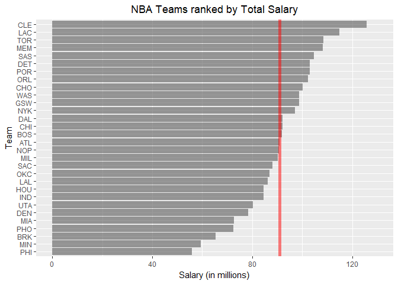
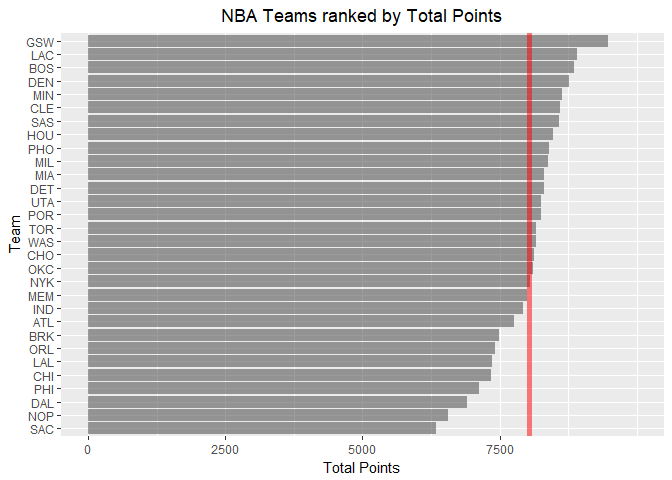
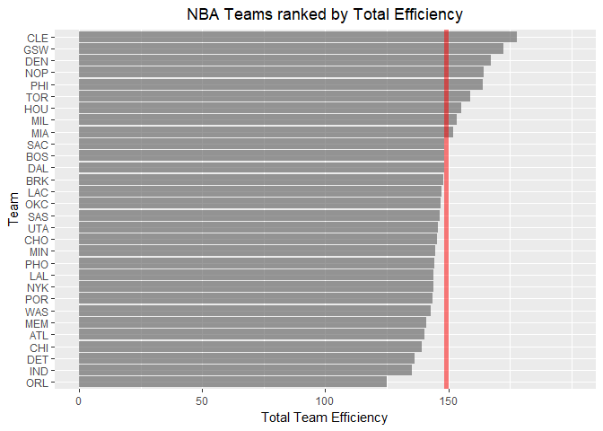

hw03-noah-weingarten
================

**Basic Rankings**
------------------

``` r
#Packages
library(readr)
library(dplyr)
```

    ## 
    ## Attaching package: 'dplyr'

    ## The following objects are masked from 'package:stats':
    ## 
    ##     filter, lag

    ## The following objects are masked from 'package:base':
    ## 
    ##     intersect, setdiff, setequal, union

``` r
library(ggplot2)
```

``` r
#loading the data
teams <- read_csv(file = "../data/nba2017-teams.csv")
```

    ## Parsed with column specification:
    ## cols(
    ##   team = col_character(),
    ##   experience = col_integer(),
    ##   salary = col_double(),
    ##   points3 = col_integer(),
    ##   points2 = col_integer(),
    ##   free_throws = col_integer(),
    ##   points = col_integer(),
    ##   off_rebounds = col_integer(),
    ##   def_rebounds = col_integer(),
    ##   assists = col_integer(),
    ##   steals = col_integer(),
    ##   blocks = col_integer(),
    ##   turnovers = col_integer(),
    ##   fouls = col_integer(),
    ##   efficiency = col_double()
    ## )

#### **Ranking teams according to salary**

``` r
ggplot(teams, aes(x = reorder(team, salary), y = salary)) +
  geom_bar(position = "dodge", stat = "identity", alpha = 0.6) +
  coord_flip() +
  scale_y_continuous(name = "Salary (in millions)", breaks = c(0, 40, 80, 120), limits = c(0, 130)) +
  geom_hline(yintercept = mean(teams$salary), size = 2, color = "red", alpha = 0.5) +
  ggtitle("NBA Teams ranked by Total Salary") +
  xlab("Team") +
  theme(plot.title = element_text(hjust = 0.5))
```



#### **Ranking teams according to points scored**

``` r
ggplot(teams, aes(x = reorder(team, points), y = points)) +
  geom_bar(position = "dodge", stat = "identity", alpha = 0.6) +
  coord_flip() +
  scale_y_continuous(name = "Total Points", breaks = c(0, 2500, 5000, 7500), limits = c(0, 10000)) +
  geom_hline(yintercept = mean(teams$points), size = 2, color = "red", alpha = 0.5) +
  ggtitle("NBA Teams ranked by Total Points") +
  xlab("Team") +
  theme(plot.title = element_text(hjust = 0.5))
```



#### **Ranking teams according to total team efficiency**

``` r
ggplot(teams, aes(x = reorder(team, efficiency), y = efficiency)) +
  geom_bar(position = "dodge", stat = "identity", alpha = 0.6) +
  coord_flip() +
  scale_y_continuous(name = "Total Team Efficiency", breaks = c(0, 50, 100, 150), limits = c(0, 200)) +
  geom_hline(yintercept = mean(teams$efficiency), size = 2, color = "red", alpha = 0.5) +
  ggtitle("NBA Teams ranked by Total Efficiency") +
  xlab("Team") +
  theme(plot.title = element_text(hjust = 0.5))
```



#### **Description of the obtained rankings so far**

> For the most part, the teams with the higher salaries score more points and are more efficient, but there are some clear exceptions to this. One team that seems to get the most out of the money they spend is the Philadelphia 76ers. They have the lowest total team salary and rank near the bottom in total points scored, but their total team efficiency is among the best in the entire NBA. Without knowing much about the sport of basketball, this leads me to believe that the 76ers are very efficient at things like rebounding, creating turnovers, and overall playing good defense. Despite how efficient they may be on defense, you can't win games if you don't score which is supported by the fact that they had the second worse record in their conference. This shows that while efficiency is a useful statistic that attempts to provide a clear picture of a teams ability, it is far from perfect.

**Principal Components Analysis (PCA)**
---------------------------------------

``` r
#Eigenvalues

teams.pca <- teams[c("points3", "points2", "free_throws", "off_rebounds", "def_rebounds",
                     "assists", "steals", "blocks", "turnovers", "fouls")]

pca <- prcomp(teams.pca, scale. = TRUE)

eigs <- data.frame(
  eigenvalue = pca$sdev^2,
  proportion = round((pca$sdev^2) / sum(pca$sdev^2), 4)
)

eigs$cumprop <- cumsum(eigs$proportion)
eigs
```

    ##    eigenvalue proportion cumprop
    ## 1  4.69588631     0.4696  0.4696
    ## 2  1.70201009     0.1702  0.6398
    ## 3  0.97952464     0.0980  0.7378
    ## 4  0.77171938     0.0772  0.8150
    ## 5  0.53408824     0.0534  0.8684
    ## 6  0.47801622     0.0478  0.9162
    ## 7  0.38220374     0.0382  0.9544
    ## 8  0.26026243     0.0260  0.9804
    ## 9  0.13359274     0.0134  0.9938
    ## 10 0.06269622     0.0063  1.0001

#### **PCA Plot for PC1 and PC2**

``` r
PC1 <- pca$x[ , 1]
PC2 <- pca$x[ , 2]

ggplot(data = teams, aes(x = PC1, y = PC2)) + geom_text(label = teams$team) +
  labs(x = "PC1", y = "PC2", title = "PCA plot (PC1 and PC2)") +
  geom_hline(yintercept = 0) + geom_vline(xintercept = 0)
```


#### **Index based on PC1**

``` r
PC1_transformed <- 100 * (PC1 - min(PC1))/(max(PC1) - min(PC1))
```

#### **Ranking teams according to scaled PC1**

``` r
ggplot(teams, aes(x = reorder(team, PC1_transformed), y = PC1_transformed)) +
  geom_bar(position = "dodge", stat = "identity", alpha = 0.6) +
  coord_flip() +
  scale_y_continuous(name = "First PC (Scaled from 1 to 100)", breaks = c(0, 25, 50, 75), limits = c(0, 100)) +
  ggtitle("NBA Teams ranked by Scaled PC1") +
  xlab("Team") +
  theme(plot.title = element_text(hjust = 0.5))
```


> Ranking the teams with the PC1 Index tells a slightly different story than the previous rankings. The biggest thing that jumps out to me is the ranking of the Cleveland Cavaliers. The Eastern Conference Champions are the 6th lowest team as far as PC1 can tell. Aside from that, the Warriors are far and away the number 1 ranked team, and the bottom 3 teams are separated from the rest to a more extreme degree. These things may be due to the way the data is scaled.

**Comments and Reflections**
----------------------------

> This was the first time working on a project with this structure for me. I am definitely grateful for the experience. While it was difficult and time consuming at stages, I feel like I'm learning something very applicable with this class.

> Using relative paths makes everything much easier for the most part.

> This was my first time using an R script as well. I normally just use R Markdown. I can definitely see the benefit to using scripts because it makes the final product cleaner.

> I wouldn't say that anything in particular was hard or easy. The difficulty was right at what I expect it to be.

> I didn't receive any help in completing the assignment.

> I'd say it took me about 10 hours over the course of 2 days to complete.

> The most time consuming part was probably creating the first graph because I was unfamiliar with ggplot2. But after the general structure of the first graph was set, the other ones went much quicker.

> I love sports, and while I'm nothing more than a casual fan of basketball, advanced metrics have been an interest of mine for a while now. I'm definitely grateful for the chance to learn how to actually work with some.
